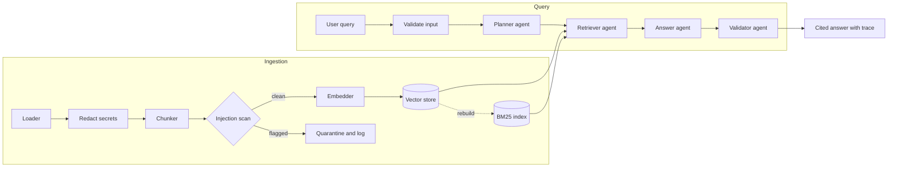
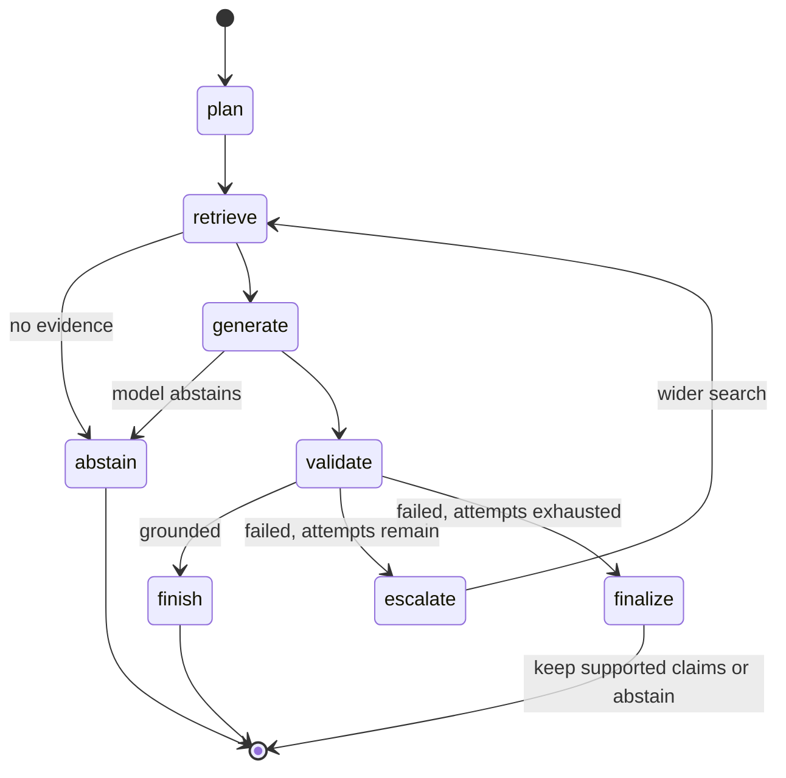
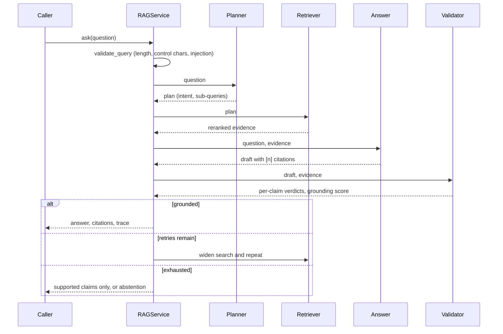

# Enterprise Multi-Agent RAG

Retrieval-augmented question answering built as four cooperating agents (planner, retriever, answer,
validator) with hybrid search, verified citations and a hallucination gate. It answers from your
documents, shows where each claim came from, and says so when the documents do not contain the answer.

The default configuration runs fully offline with no API keys. Production configurations use OpenAI or
Anthropic models, OpenAI embeddings and Qdrant.

## Table of contents

- [Project overview](#project-overview)
- [Architecture](#architecture)
- [Features](#features)
- [Repository structure](#repository-structure)
- [Installation](#installation)
- [Quick start](#quick-start)
- [Detailed usage](#detailed-usage)
- [Configuration](#configuration)
- [Security](#security)
- [Testing](#testing)
- [CI/CD](#cicd)
- [Limitations](#limitations)
- [Roadmap](#roadmap)
- [Contributing](#contributing)
- [License](#license)

## Project overview

### What it is

A Python library and CLI that ingests a folder of documents, then answers questions against it. Each
answer is a set of sentences, each tagged with the passage it came from (`[1]`, `[2]`, ...). Before an
answer is returned, a validator checks every sentence against its cited passage.

### Why it exists

Most RAG systems retrieve once and trust the model. In practice that produces three recurring problems:

1. Compound questions ("how long must passwords be, and how often are they rotated?") retrieve for one
   half and silently ignore the other.
2. Models state figures and policies that no retrieved passage contains.
3. Text inside documents can carry instructions aimed at the model.

Here each problem has a dedicated component and dedicated tests.

### Who should use it

- Teams building internal knowledge assistants over policies, runbooks, contracts or engineering docs.
- Engineers who need auditable answers, where a reviewer can click from a claim to its source.
- Platform teams that want a reference structure for agentic RAG with clean provider boundaries.

### Business value

| Outcome | Mechanism |
| ------- | --------- |
| Fewer confidently wrong answers reaching users | Validator removes or blocks unsupported claims and reports how many |
| Faster review and audit | Every answer carries citations and a per-node execution trace |
| Lower risk from poisoned documents | Injection-like chunks are quarantined; credentials are redacted before indexing |
| No vendor lock-in | Embedders, models, stores and rerankers are swappable behind protocols |
| Cheap development and CI | Offline mode needs no keys, network or GPU |

## Architecture

### System architecture



### Agent architecture

| Agent | Responsibility |
| ----- | -------------- |
| **Planner** | Classifies intent (factual, definition, procedure, comparison) and splits compound questions into sub-queries. An optional LLM proposal is validated and merged; any failure falls back to deterministic rules. |
| **Retriever** | Runs each sub-query through dense plus BM25 search fused with reciprocal rank fusion, pools the results and reranks them against the full question. Irrelevant candidates are dropped, which is what makes out-of-scope questions abstain. |
| **Answer** | Drafts a cited answer. `ExtractiveGenerator` quotes the best-matching sentences; `LLMGenerator` synthesizes with OpenAI or Anthropic under a strict citation prompt. |
| **Validator** | Splits the draft into claims and checks citation validity, content-word support and numeric consistency against the cited passages. |

### Execution flow



### Data flow for one question



Design details and trade-offs are in [docs/architecture.md](docs/architecture.md), with decision
records in [docs/adr](docs/adr).

## Features

- **Multi-agent pipeline** with a bounded state-machine engine, retry-and-widen and claim filtering.
- **Hybrid retrieval**: dense vectors plus BM25, weighted reciprocal rank fusion, lexical reranking.
- **Query planning**: intent classification, compound-question splitting, comparison expansion.
- **Verified citations**: every sentence is checked against the passages it cites.
- **Hallucination detection**: uncited claims, phantom citations, numbers absent from the evidence and
  low-support statements are flagged; unsupported claims are removed and counted.
- **Abstention**: returns an explicit "not enough information" answer instead of guessing.
- **Providers**: extractive (offline), OpenAI, Anthropic; hashing (offline) and OpenAI embeddings.
- **Stores**: in-memory with atomic JSON persistence, or Qdrant over REST.
- **Ingestion**: sentence-aware overlapping chunks, Markdown section tracking, idempotent re-ingest that
  removes stale chunks, size limits, binary detection, no symlink following.
- **Security**: input validation, injection screening for queries and corpus, credential redaction,
  redacting logs, `SecretStr` for every key.
- **Operability**: structured JSON logs, metrics hooks, per-node timing trace, bounded retries.
- **Typed and tested**: `mypy --strict`, ruff, an 80% coverage gate, unit and integration tests that
  run offline.

## Repository structure

```
enterprise-multi-agent-rag/
├── .github/
│   ├── dependabot.yml
│   └── workflows/
│       ├── ci.yml                    # lint, format, types, tests, audit, build
│       └── codeql.yml                # static analysis
├── data/sample_corpus/               # three sample policy documents used in the examples
├── docs/
│   ├── architecture.md
│   └── adr/                          # architecture decision records
├── src/emrag/
│   ├── agents/
│   │   ├── planner.py                # intent + sub-query planning
│   │   ├── retriever.py              # multi-query retrieval + rerank
│   │   ├── generator.py              # extractive and LLM answer strategies
│   │   ├── validator.py              # grounding and hallucination checks
│   │   └── state.py                  # workflow state
│   ├── ingestion/                    # loader, chunker
│   ├── providers/                    # HTTP client, embeddings, chat clients
│   ├── retrieval/                    # BM25, hybrid fusion, reranker
│   ├── stores/                       # vector store protocol, memory, Qdrant
│   ├── cli.py                        # emrag ingest | ask | stats
│   ├── config.py                     # typed settings
│   ├── container.py                  # composition root (dependency injection)
│   ├── errors.py
│   ├── graph.py                      # workflow engine
│   ├── logging_setup.py              # JSON logging with redaction
│   ├── metrics.py                    # metrics hooks
│   ├── models.py
│   ├── pipeline.py                   # graph wiring and answer assembly
│   ├── retry.py
│   ├── security.py                   # validation, injection screening, redaction
│   ├── service.py                    # ingest / ask facade
│   └── text.py
├── tests/
│   ├── unit/
│   ├── integration/
│   └── conftest.py                   # fakes: scripted LLM, Qdrant REST server
├── .env.example
├── CHANGELOG.md
├── CONTRIBUTING.md
├── Dockerfile
├── LICENSE
├── Makefile
├── SECURITY.md
├── docker-compose.yml
├── pyproject.toml
├── requirements.txt
└── requirements-dev.txt
```

## Installation

Requirements: Python 3.10 or newer.

```bash
git clone <repository-url>
cd enterprise-multi-agent-rag
python -m venv .venv
source .venv/bin/activate            # Windows: .venv\Scripts\activate
python -m pip install -e ".[dev]"
```

Runtime-only install: `python -m pip install -e .`

## Quick start

Ingest the bundled sample corpus and ask questions. No keys or network access are required.

```bash
emrag ingest data/sample_corpus
emrag ask "How long must passwords be and how often are privileged passwords rotated?"
```

```
All employee passwords must be at least 14 characters long [1]. Passwords must be rotated every 90 days for privileged accounts [1].

Sources:
  [1] security_policy.md > Information Security Policy

Grounding score: 1.00
```

A question the corpus cannot answer is refused rather than guessed:

```bash
emrag ask "What is the airspeed velocity of a swallow?"
```

```
The indexed sources do not contain enough information to answer this question.

Grounding score: 1.00
```

Add `--trace` to see what each agent did and how long it took, or `--json` for machine-readable output.

## Detailed usage

### 1. Python API

```python
from pathlib import Path

from emrag import Settings, build_service

service = build_service(Settings())
service.ingest(Path("data/sample_corpus"))

answer = service.ask("How quickly must a lost laptop be reported?")
print(answer.text)  # sentences with [n] citations
for citation in answer.citations:
    print(citation.index, citation.source, citation.snippet)
print(answer.grounding_score, answer.abstained, answer.removed_claims)
for event in answer.trace:  # plan, retrieve, generate, validate, ...
    print(event.node, event.duration_ms, event.detail)
```

`ask` raises `emrag.errors.SecurityError` for empty, oversized or injection-like queries.

### 2. Inspecting agent behaviour

```bash
emrag ask "What is the difference between severity 1 and severity 2 incidents?" --trace
```

The trace lists each node with its duration and a detail line, for example the number of sub-queries the
planner produced or the count of unsupported claims the validator found.

### 3. Using a hosted model for synthesis

```bash
export EMRAG_LLM_PROVIDER=anthropic       # or: openai
export EMRAG_ANTHROPIC_API_KEY=...        # or EMRAG_OPENAI_API_KEY
emrag ask "Summarize the incident response targets for severity 1 and 2."
```

The model receives only the retrieved passages, must cite them, and its output is validated like any
other draft. If a draft fails validation the pipeline retries with a wider search, then falls back to the
supported claims.

### 4. Production embeddings

```bash
export EMRAG_EMBEDDING_PROVIDER=openai
export EMRAG_OPENAI_API_KEY=...
export EMRAG_OPENAI_EMBEDDING_DIM=1536
emrag ingest ./docs
```

Changing the embedding provider changes vector dimensions; re-ingest into a fresh data directory or
Qdrant collection. A dimension mismatch is detected and reported rather than silently corrupting search.

### 5. Qdrant

```bash
docker compose up -d qdrant
docker compose run --rm emrag ingest /corpus
docker compose run --rm emrag ask "What is the hotel cap per night?"
```

Or against your own server: `EMRAG_VECTOR_STORE=qdrant EMRAG_QDRANT_URL=https://...
EMRAG_QDRANT_API_KEY=...`. Re-ingesting a document replaces its previous chunks.

### 6. Custom components

Every collaborator is a `Protocol`. To replace the reranker, for instance:

```python
from emrag.retrieval import Reranker
from emrag.models import ScoredChunk


class MyCrossEncoder:
    def rerank(self, queries, candidates, top_n) -> list[ScoredChunk]: ...
```

Then pass it to `RetrieverAgent` in `container.build_service`. See [CONTRIBUTING.md](CONTRIBUTING.md).

### 7. Metrics

Pass any object with `incr` and `observe` methods:

```python
from emrag import Settings, build_service
from emrag.metrics import InMemoryMetrics

metrics = InMemoryMetrics()
service = build_service(Settings(), metrics=metrics)
# ... run queries ...
print(metrics.snapshot())
```

Emitted series: `emrag.queries`, `emrag.answers{outcome}`, `emrag.grounding_score`,
`emrag.node_ms{node}`, `emrag.ingested_chunks`.

## Configuration

Settings are read from `EMRAG_*` environment variables and an optional `.env` file. Copy
[.env.example](.env.example) to get started.

| Variable | Default | Purpose |
| -------- | ------- | ------- |
| `EMRAG_LLM_PROVIDER` | `extractive` | `extractive`, `openai` or `anthropic` |
| `EMRAG_EMBEDDING_PROVIDER` | `hashing` | `hashing` or `openai` |
| `EMRAG_VECTOR_STORE` | `memory` | `memory` or `qdrant` |
| `EMRAG_OPENAI_API_KEY` | unset | Also accepts `OPENAI_API_KEY` |
| `EMRAG_OPENAI_BASE_URL` | `https://api.openai.com/v1` | Any OpenAI-compatible endpoint |
| `EMRAG_OPENAI_CHAT_MODEL` | `gpt-4o-mini` | Chat model |
| `EMRAG_OPENAI_EMBEDDING_MODEL` | `text-embedding-3-small` | Embedding model |
| `EMRAG_OPENAI_EMBEDDING_DIM` | `1536` | Must match the embedding model |
| `EMRAG_ANTHROPIC_API_KEY` | unset | Also accepts `ANTHROPIC_API_KEY` |
| `EMRAG_ANTHROPIC_MODEL` | `claude-sonnet-5` | Chat model |
| `EMRAG_ANTHROPIC_MAX_TOKENS` | `1024` | Response length cap |
| `EMRAG_QDRANT_URL` | `http://localhost:6333` | Qdrant endpoint |
| `EMRAG_QDRANT_API_KEY` | unset | Qdrant API key |
| `EMRAG_QDRANT_COLLECTION` | `emrag_chunks` | Collection name |
| `EMRAG_DATA_DIR` | `.emrag` | Location of the in-memory store snapshot |
| `EMRAG_CHUNK_MAX_CHARS` / `EMRAG_CHUNK_OVERLAP_CHARS` | `900` / `150` | Chunk size and overlap |
| `EMRAG_MAX_FILE_BYTES` | `5000000` | Larger files are skipped |
| `EMRAG_RETRIEVAL_TOP_K` | `12` | Candidates per sub-query |
| `EMRAG_RERANK_TOP_N` | `5` | Evidence passages kept |
| `EMRAG_MIN_QUERY_COVERAGE` | `0.2` | Reranker floor for query-term coverage |
| `EMRAG_MAX_SUB_QUERIES` | `4` | Planner cap |
| `EMRAG_MIN_CLAIM_SUPPORT` | `0.6` | Per-claim content-word support required |
| `EMRAG_MIN_GROUNDING_SCORE` | `0.8` | Fraction of supported claims required to pass |
| `EMRAG_MAX_ATTEMPTS` | `2` | Widening retries after a failed validation |
| `EMRAG_MAX_QUERY_CHARS` | `2000` | Query length cap |
| `EMRAG_REJECT_INJECTION_QUERIES` | `true` | Reject queries matching injection heuristics |
| `EMRAG_HTTP_TIMEOUT_SECONDS` | `30` | Upstream request timeout |
| `EMRAG_RETRY_ATTEMPTS` / `_MIN_WAIT` / `_MAX_WAIT` | `3` / `0.5` / `8` | Retry policy for transient upstream errors |
| `EMRAG_LOG_LEVEL` | `INFO` | Log level |
| `EMRAG_LOG_JSON` | `true` | JSON logs to stderr, or plain text when `false` |

Selecting a provider without its key fails at startup with a `ConfigurationError` naming the missing
variable.

## Security

| Threat | Control |
| ------ | ------- |
| Injection in queries | Screened and rejected before any agent runs |
| Injection in documents | Matching chunks are quarantined at ingestion and never indexed |
| Injected text that gets through | Evidence is delimited and marked untrusted in the prompt; validator rejects unsupported claims |
| Credentials in documents | Redacted before embedding and storage |
| Credentials in logs and errors | Redaction on every log record and CLI error; keys held as `SecretStr` |
| Oversized or hostile files | Size limits, binary detection, symlinks never followed |
| Runaway loops | Bounded retries and a workflow step budget |
| Vulnerable dependencies | `pip-audit`, Dependabot and CodeQL in CI |
| Container | Multi-stage build, non-root user |

Screening and redaction are heuristic and the grounding check is lexical; see [Limitations](#limitations)
and [SECURITY.md](SECURITY.md) for the full policy and how to report a vulnerability.

## Testing

```bash
python -m pytest                                  # all tests, coverage gate at 80%
python -m pytest tests/unit                       # unit tests only
python -m pytest -m integration                   # end-to-end tests only
python -m pytest --cov --cov-report=term-missing  # see uncovered lines
```

- **Unit tests** cover text handling, security, chunking, loading, providers (with mocked HTTP), stores,
  retrieval, each agent, the workflow engine, configuration, logging and metrics.
- **Integration tests** run the full stack: extractive answers over the sample corpus, ingestion safety,
  persistence, LLM flows against a mock OpenAI/Anthropic server (including a hallucinating model),
  Qdrant against an in-process fake REST server, and the CLI.
- All tests run offline. Fakes live in `tests/conftest.py`.

Static checks: `make lint` (ruff) and `make typecheck` (`mypy --strict`).

## CI/CD

`.github/workflows/ci.yml` runs on every push to `main` and every pull request:

| Job | What it does |
| --- | ------------ |
| Lint, format and types | `ruff check`, `ruff format --check`, `mypy --strict` |
| Tests | Python 3.10 to 3.13 matrix, coverage gate at 80%, coverage report artifact |
| Dependency audit | `pip-audit` against `requirements.txt` |
| Build validation | Builds sdist and wheel, `twine check`, builds and smoke-tests the Docker image |

`.github/workflows/codeql.yml` runs CodeQL on pushes, pull requests and weekly. Dependabot proposes
weekly updates for pip, GitHub Actions and Docker.

## Limitations

- **Grounding is lexical.** The validator checks citations, word overlap and numbers. It will not catch
  a claim that reuses supported words in an unsupported relationship. Pair it with an entailment model
  or LLM judge for high-stakes domains.
- **The default embedder is not semantic.** `hashing` captures lexical overlap. Use `openai` embeddings
  (or your own) when queries and documents use different vocabulary.
- **The extractive generator quotes; it does not synthesize.** Use an LLM provider for fluent,
  multi-passage answers.
- **Scale.** The in-memory store scans every vector and BM25 lives in memory, rebuilt on startup. Use
  Qdrant and plan a sparse-index replacement beyond a few hundred thousand chunks.
- **Formats.** Plain text, Markdown and reStructuredText only.
- **Not benchmarked.** No accuracy or latency benchmarks against public datasets are published yet.

## Roadmap

| Milestone | Scope |
| --------- | ----- |
| Next | PDF and HTML loaders; evaluation harness (answer accuracy, citation precision, abstention rate) with a labelled sample set |
| Next | Cross-encoder reranker behind the existing `Reranker` protocol |
| Later | Entailment-based validator combined with the lexical check |
| Later | LangGraph adapter for teams that need checkpointing and streaming |
| Later | HTTP service with authentication, request tracing and OpenTelemetry metrics |
| Later | Qdrant sparse vectors to replace the in-memory BM25 index |
| Later | Per-tenant collections and document-level access control |

## Contributing

Contributions are welcome. Read [CONTRIBUTING.md](CONTRIBUTING.md) for setup, quality gates and how to
add providers, stores and rerankers. Report vulnerabilities privately as described in
[SECURITY.md](SECURITY.md).

## License

Released under the [MIT License](LICENSE).
