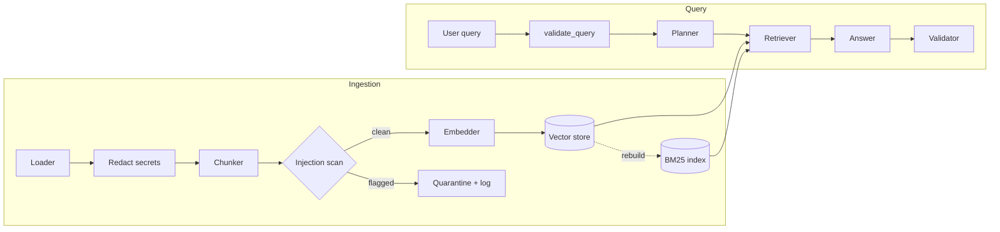
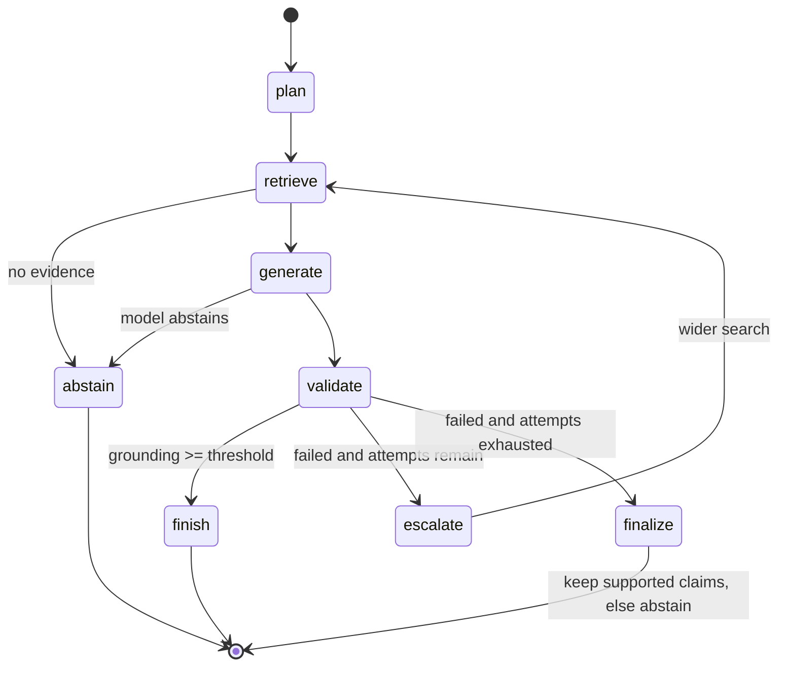

# Architecture

## Problem statement

Single-pass RAG systems retrieve top-k passages and let a model answer. Three failure modes follow:
compound questions retrieve for one intent and miss the other, models state facts the passages do not
support, and hostile text in the corpus or the query steers the model. This project treats each as a
separate responsibility with its own agent and its own tests.

## Requirements

| # | Requirement | Where it is met |
| - | ----------- | --------------- |
| R1 | Answer compound and comparison questions | Planner decomposes into sub-queries; retriever pools results |
| R2 | Every claim carries a citation to a source passage | Answer contract plus validator citation checks |
| R3 | Unsupported claims are detected and never returned silently | Validator; finalize node drops them and reports the count |
| R4 | Abstain when the corpus does not contain the answer | Retriever filter, generator abstention, finalize fallback |
| R5 | Run fully offline for development and CI | Hashing embedder, extractive generator, mock transports |
| R6 | Swap providers without touching agent code | `Protocol`s and a single composition root |
| R7 | Treat corpus and queries as untrusted | `security.py`, ingestion quarantine, prompt delimiting |
| R8 | Observable | Structured logs, metrics hooks, per-node trace on every answer |

## System overview

## Execution flow

Each node appends a `TraceEvent` (name, detail, duration) to the answer, so every response explains
how it was produced.

## Agents

| Agent | Input | Output | Notes |
| ----- | ----- | ------ | ----- |
| Planner | Question | `QueryPlan` (intent, sub-queries) | Rule-based; an optional LLM proposal is validated and merged, and any failure falls back to rules |
| Retriever | Plan | Ranked evidence | Runs each sub-query through hybrid search, pools by best score, reranks against the full question; each retry widens `top_k` and `top_n` |
| Answer | Question and evidence | Cited draft | `ExtractiveGenerator` quotes sentences; `LLMGenerator` synthesizes under a strict citation prompt |
| Validator | Draft and evidence | `ValidationReport` | Splits the draft into claims and checks citation validity, content-word support and numbers |

## Data flow and retrieval

1. **Ingest.** Documents are read, credentials are redacted, text is split into overlapping,
   sentence-aligned chunks (Markdown headings become the chunk's `section`), chunks that resemble
   injection are quarantined, the rest are embedded and upserted. Re-ingesting a document first deletes
   its previous chunks, so edits never leave stale text behind.
2. **Search.** Dense and BM25 rankings for a sub-query are fused with weighted reciprocal rank fusion
   (`score = Σ w / (60 + rank)`), which needs no score calibration between the two systems.
3. **Rerank.** A lexical reranker scores query-term coverage and bigram overlap and drops candidates
   below a coverage floor. This is what turns an off-topic question into an empty evidence set and
   therefore an abstention.

## Validation semantics

A claim (sentence) is supported when all of the following hold:

- it cites at least one passage and every citation index exists,
- at least `min_claim_support` of its content words appear in the cited passages,
- every number it states appears in the cited passages.

The answer passes when the supported fraction reaches `min_grounding_score`. On failure the pipeline
retries with a wider search up to `max_attempts` times; after that it returns only the supported claims
and reports `removed_claims`, or abstains if none remain.

## Architectural decisions

See [docs/adr](adr) for the reasoning behind the workflow engine, provider clients and validator.

## Trade-offs

| Decision | Benefit | Cost |
| -------- | ------- | ---- |
| Lexical grounding check | Deterministic, free, fast, testable | Cannot detect a claim that reuses the right words with the wrong meaning; an NLI or LLM-judge check is the next step |
| Hashing embedder default | No model download, reproducible tests | Lexical similarity only; production should use `openai` embeddings |
| In-memory store scans all vectors | Simple, exact | Linear in corpus size; use Qdrant beyond a few hundred thousand chunks |
| Retry widens retrieval | Recovers from narrow first-pass evidence | Adds latency and, with an LLM, up to `max_attempts` extra calls per question |

## Scalability

- Retrieval and validation are stateless per request, so the service scales horizontally behind a shared
  Qdrant.
- Ingestion embeds in provider-sized batches and writes to Qdrant in batches of 128 points.
- BM25 is rebuilt in memory from the store at startup and after ingestion. That cost grows with corpus
  size and is the first thing to replace (for example with Qdrant sparse vectors) at large scale.
- LLM cost per question is one generation plus up to `max_attempts` retries and one optional planner
  call.

## Extensibility

New embedders, LLM clients, stores, rerankers and answer strategies are added by implementing a
`Protocol` and registering it in `container.py`. See [CONTRIBUTING.md](../CONTRIBUTING.md).
